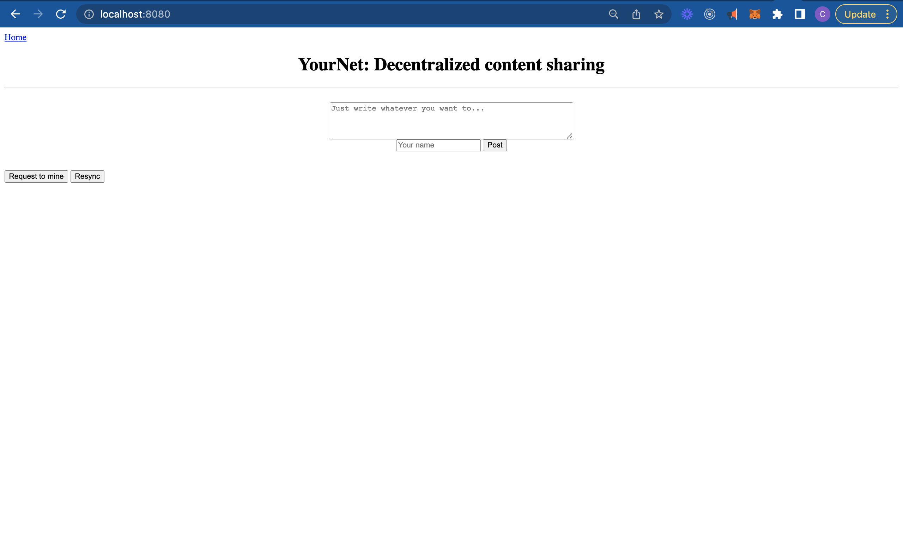
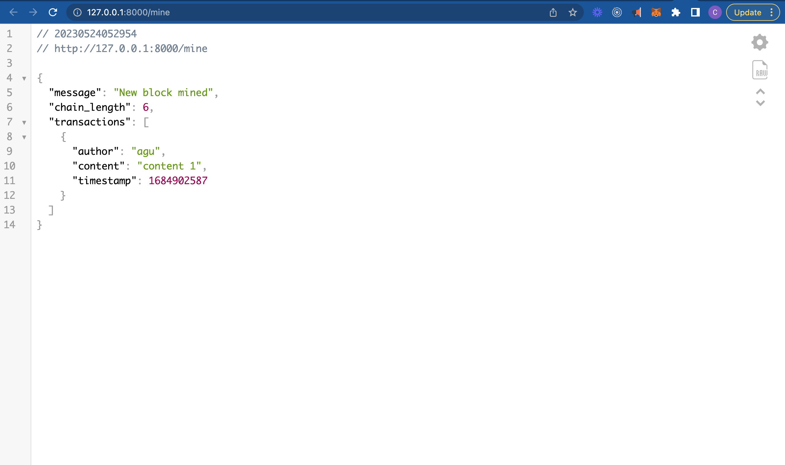
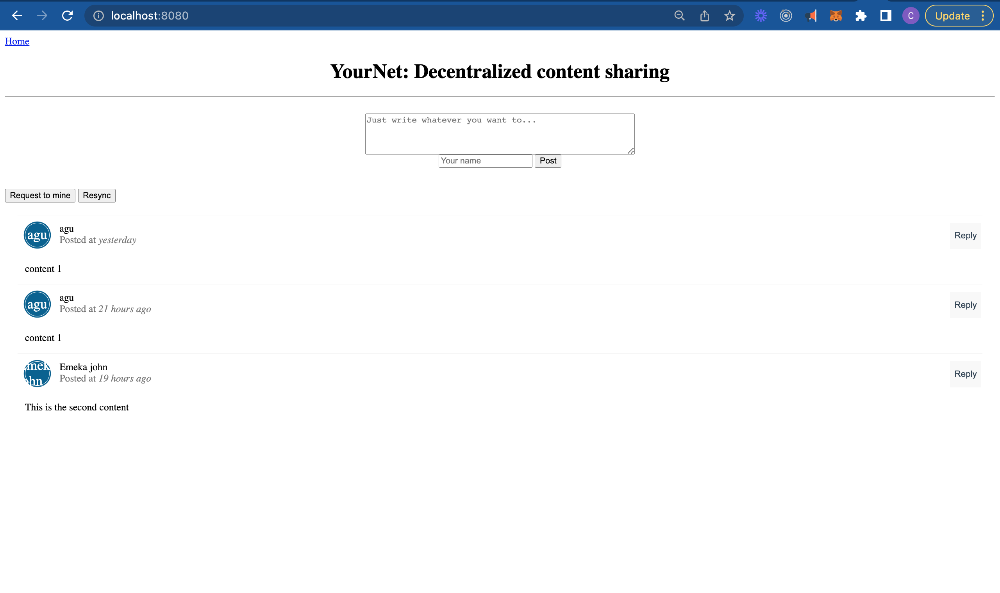

# Go_blockchain_app

A simplest blockchain implementation using go language

## Instructions to run

Clone the project,

```sh
$ git clone git@github.com:chokey2nv/ultainfinity-blockchain.git
```

Install the dependencies,

```sh
$ cd ultainfinity-blockchain
$ go mod download
```

# Start a blockchain node server,
Use Makefile to start node server, this starts the node server on port 8000
```sh
$ make node
```
or run directly
```sh
$ go run main.go node 
```
Add in flag `--port` to override the default port of 8000, changing port helps spin up multiple nodes locally.
```sh
$ go run main.go node --port 8001
```


# Start a blockchain client server,
using Makefile, this start a client server on port 8080
```sh
$ make client
```
or start directly by running
```sh
$ go run main.go client
```
you can pass in env variable (`BLOCKCHAIN_NODE`) here for the node address to communicate with, by default it communicates with http://localhost:8000

# Concurrently run client and node server
Run this code to start client and node server, you can pass in `--node-port` flag to override the node port (8000)
```sh
$ go run main.go all
```
```sh
$ go run main.go all --node-port 8001
```
or using Makefile
```sh
$ make all
```
this start a client server on port 8080 and node server on port 8000

### Run Multiple Nodes and client using Docker Compose

```sh
$ docker-compose up
```
This will spin up 4 instances of blockchain node and an instance of the client server. By default the client communicate with node1 (runs on port 8000), and client server itself runs on port `8080`

http://localhost:8080


Here are a few screenshots

1. Posting some content



1. Requesting the node to mine



1. Resyncing with the chain for updated data



To play around by spinning off multiple custom nodes, use the `register_with/` endpoint to register a new node. 

Here's a sample scenario that you might wanna try,

```sh
# already running (--port 8000)
$ go run main.go node &
# spinning up new nodes
$ go run main.go node --port 8001 &
$ go run main.go node --port 8002 
```

You can use the following cURL requests to register the nodes at port `8001` and `8002` with the already running `8000`.

```sh
curl -X POST \
  http://127.0.0.1:8001/register_with \
  -H 'Content-Type: application/json' \
  -d '{"node_address": "http://127.0.0.1:8000"}'
```

```sh
curl -X POST \
  http://127.0.0.1:8002/register_with \
  -H 'Content-Type: application/json' \
  -d '{"node_address": "http://127.0.0.1:8000"}'
```

This will make the node at port 8000 aware of the nodes at port 8001 and 8002, and make the newer nodes sync the chain with the node 8000, so that they are able to actively participate in the mining process post registration.

Once you do all this, you can run the application, create transactions (post messages via the web inteface), and once you mine the transactions, all the nodes in the network will update the chain. The chain of the nodes can also be inspected by inovking `/chain` endpoint using cURL.

```sh
$ curl -X GET http://localhost:8001/chain
$ curl -X GET http://localhost:8002/chain
```
